I build web applications end to end — Node.js and Express on the back, React and
Next.js on the front — and I put language models into them where they earn their
place. Full Stack Developer at PT Unicorn, based in Ubud, Bali.

Most of what I enjoy is the part after it works: finding out *why* it is slow, and
being willing to be wrong about the answer.


### Selected work

<a href="https://rizky-portfolio.pages.dev"></a>
<a href="https://apply-mate-ai-nine.vercel.app"></a>
<a href="https://sikemasbpsdm.web.id"></a>
<a href="https://barakah-qurban.vercel.app"></a>

Source: [portfolio-v2](https://github.com/rizky-rahmad/portfolio-v2) · [ApplyMateAi](https://github.com/rizky-rahmad/ApplyMateAi) · [barakah-qurban](https://github.com/rizky-rahmad/barakah-qurban)


### Shipping now — PT Unicorn, production systems

What I run in production every day: restaurants take bookings through these
systems, and HR runs attendance and hiring on them.

**Channelflow — omnichannel inbox + AI agent + bookings engine.**
WhatsApp, Instagram, Email and TikTok in one inbox. A grounded multilingual AI
answers from the knowledge base and live menu, takes bookings, and hands off
to humans on allergy, VIP and low-confidence cases.

**Channelflow Mobile — the staff app, on Android.** The dashboard's bookings
in a pocket: 14-day list, day timeline, month view, analytics. Same backend,
same data, verified screen by screen on an emulator.

 

**CMS — multi-tenant page builder.** One deploy serves many brands: free-form
drag-and-drop builder, in-place editing, autosave drafts, design import,
per-site themes and domains. All media served locally.

**PeopleOS — HR / workforce operating system.** The whole employee lifecycle:
GPS time-clock with geofencing, outlet scheduling, hiring ATS with video
answers and AI scoring, training, announcements. Web app plus a React Native
companion.

 

<details>
<summary><b>How the portfolio chatbot actually works</b> — and the 49s → 2s story</summary>

<br>

My résumé lives in a Google Doc, and the certificates in it are scans — images
only a vision model can read. The obvious implementation sends that document to
the model on every message. That is what it did at first, and it cost about
**40 seconds per reply** to produce a reading that came out identical every time.

The fix was not a faster model or a smaller payload. It was doing the reading at
a different moment:


The document is hashed first, so an unchanged résumé costs nothing at all. I
still update it the same way as before: by pasting into the Doc.

**What I got wrong on the way there:** I was sure the cost was the 2.2MB going
over the wire each message. Measured, that transfer was under 5% of the time. The
expensive part was the model re-reading eight pages of scanned certificates.

</details>

<details>
<summary><b>Making the same site score 98 on mobile</b></summary>

<br>

Mobile PageSpeed sat at 90 with LCP 3.5s while desktop was already perfect —
which is exactly why it went unnoticed for months.

The LCP element was the hero subtitle, and it was fading in:

```css
.animate-fade-up { animation: fade-up 0.7s ease-out both; }
```

`fade-up` starts at `opacity: 0`, and `both` holds it there through the delay.
Chrome does not count a transparent element as painted, so **the metric was
waiting on my own animation**, not on the network. Giving above-the-fold text a
transform-only animation, deferring the chat widget to `requestIdleCallback`, and
inlining the render-blocking CSS took LCP from 1536ms to 508ms locally.


Best Practices stays at 96 because Cloudflare's own analytics beacon fails with
`ERR_BLOCKED_BY_CLIENT`. I left it there — real analytics is worth more than four
points.

</details>

<details>
<summary><b>What I work with</b></summary>

<br>


</details>


### How I work



I use **Claude Code** in my daily loop — not to produce code I could not explain,
but to move faster through the mechanical parts and to have something to argue
with while debugging. It is most useful exactly where I am most likely to be
confidently wrong.

Both results on this page came out of that: three plausible explanations for the
chatbot's latency were wrong before measurement settled it, and the mobile LCP
turned out to be waiting on my own CSS rather than on the network. The tool did
not know the answer either — it made it cheap to test each hypothesis until one
survived.


### Reach me

<a href="https://rizky-portfolio.pages.dev"></a>
<a href="https://linkedin.com/in/rahmad-rizki-1728a6186"></a>
<a href="mailto:rizky.business7@gmail.com"></a>
<a href="https://wa.me/6282365434655"></a>

<sub>The assistant on my portfolio will answer questions about my background before you have to ask me directly.</sub>
