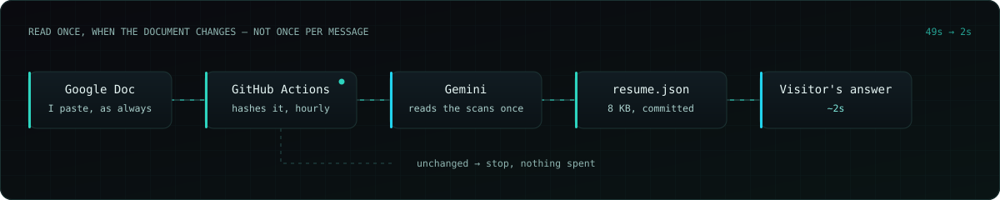

<b>How it works under the hood</b>

 

- **Never blocks a guest.** Webhooks answer in milliseconds; the AI works from a durable queue, and a crash hands the chat to a human instead of going silent.
- **Knows when to stop.** Allergy, complaints and low-confidence answers go to staff, and a second model double-checks before the AI is allowed to keep going.
- **Speaks the guest's language.** The reply language is locked to what the guest wrote, then verified; booking codes and links are checked to survive translation.
- **Reads more than text.** Voice notes are transcribed and photos are described before the AI answers.
- **Measured, not assumed.** Every number above comes from the production database; CI runs the whole test suite on each push.

<b>Everything I use</b>

 

<b>Side projects</b> — portfolio AI (49 s → 2 s replies), ApplyMate AI, SIKEMAS, Barakah Qurban

 

  

Built with Claude Code in my daily loop — to test each hypothesis fast, not to ship code I can't explain.
