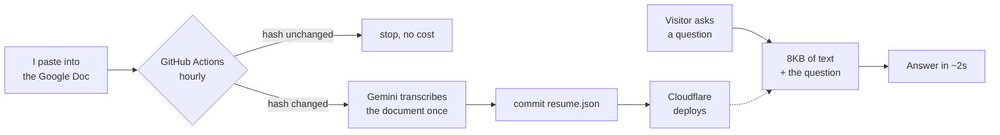

I build web applications end to end — Node.js and Express on the back, React and
Next.js on the front — and I put language models into them where they earn their
place. Based in Central Jakarta, working with institutional clients and startups.

Most of what I enjoy is the part after it works: finding out *why* it is slow, and
being willing to be wrong about the answer.

### Selected work

| Project | What it does | Live |
|---|---|---|
| **[Portfolio + AI assistant](https://github.com/rizky-rahmad/portfolio-v2)** | Answers visitors' questions from my résumé, in English or Indonesian, in ~2s | [rizky-portfolio.pages.dev](https://rizky-portfolio.pages.dev) |
| **[ApplyMate AI](https://github.com/rizky-rahmad/ApplyMateAi)** | Turns a résumé and a job posting into a match analysis and a tailored cover letter, grounded only in real experience | [apply-mate-ai-nine.vercel.app](https://apply-mate-ai-nine.vercel.app) |
| **[SIKEMAS](https://sikemasbpsdm.web.id)** | Complaint management for BPSDM Aceh — multi-role RBAC, audit logs, automated ticket dispatch | [sikemasbpsdm.web.id](https://sikemasbpsdm.web.id) |
| **[Barakah Qurban](https://github.com/rizky-rahmad/barakah-qurban)** | Landing page for a Qurban cattle provider | [barakah-qurban.vercel.app](https://barakah-qurban.vercel.app) |

<details>
<summary><b>How the portfolio chatbot actually works</b> — and the 49s → 2s story</summary>

<br>

My résumé lives in a Google Doc, and the certificates in it are scans — images
only a vision model can read. The obvious implementation sends that document to
the model on every message. That is what it did at first, and it cost about
**40 seconds per reply** to produce a reading that came out identical every time.

The fix was not a faster model or a smaller payload. It was doing the reading at
a different moment:



The document is hashed first, so an unchanged résumé costs nothing at all. I
still update it the same way as before: by pasting into the Doc.

**What I got wrong on the way there:** I was sure the cost was the 2.2MB going
over the wire each message. Measured, that transfer was under 5% of the time. The
expensive part was the model re-reading eight pages of scanned certificates.

</details>

<details>
<summary><b>Making the same site score 98 on mobile</b></summary>

<br>

Mobile PageSpeed sat at 90 with LCP 3.5s while desktop was already perfect —
which is exactly why it went unnoticed for months.

The LCP element was the hero subtitle, and it was fading in:

```css
.animate-fade-up { animation: fade-up 0.7s ease-out both; }
```

`fade-up` starts at `opacity: 0`, and `both` holds it there through the delay.
Chrome does not count a transparent element as painted, so **the metric was
waiting on my own animation**, not on the network. Giving above-the-fold text a
transform-only animation, deferring the chat widget to `requestIdleCallback`, and
inlining the render-blocking CSS took LCP from 1536ms to 508ms locally.

Result: **98 / 100 / 96 / 100**, LCP 2.3s, CLS 0, Agentic Browsing 3/3.

Best Practices stays at 96 because Cloudflare's own analytics beacon fails with
`ERR_BLOCKED_BY_CLIENT`. I left it there — real analytics is worth more than four
points.

</details>

<details>
<summary><b>What I work with</b></summary>

<br>

**Frontend** — React, Next.js (App Router), TypeScript, Tailwind CSS, Radix / shadcn-ui
**Backend** — Node.js, Express, NestJS, REST APIs, JWT & OAuth 2.0
**Data** — PostgreSQL (schema design, query optimisation), Redis, Supabase
**AI** — Gemini, OpenAI, prompt design, retrieval over real documents
**Infra** — Cloudflare Workers & Pages, Vercel, Azure Functions, GitHub Actions, Docker
**Certified** — Microsoft Azure AI Fundamentals (AI-900)

</details>

### Reach me

<a href="https://rizky-portfolio.pages.dev"></a>
<a href="https://linkedin.com/in/rahmad-rizki-1728a6186"></a>
<a href="mailto:rizky.business7@gmail.com"></a>
<a href="https://wa.me/6282365434655"></a>

<sub>The assistant on my portfolio will answer questions about my background before you have to ask me directly.</sub>
